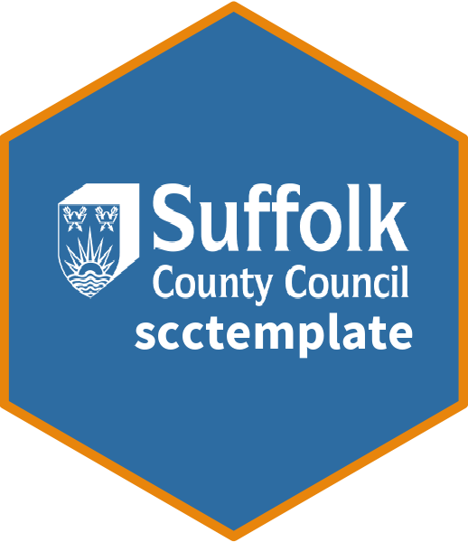

<!-- README.md is generated from README.Rmd. Please edit that file -->

```{r, include = FALSE}
knitr::opts_chunk$set(
  collapse = TRUE,
  comment = "#>",
  fig.path = "man/figures/README-",
  out.width = "100%"
)
```

# scctempplate 

<!-- badges: start -->
[](https://lifecycle.r-lib.org/articles/stages.html#experimental)
<!-- badges: end -->

The goal of `scctemplate` is to provide R markdown templates for data analysts working for Suffolk County Council. `scctemplate` lets you use RStudio to quickly produce professional, accessible, County Council branded HTML documents and websites.


There is a full template website hosted [here](https://scc-planning.github.io/scctemplate-example-site/index.html.).

The `sccthemes` cookbook has also been built using this template, that can be found [here](https://scc-planning.github.io/scc-cookbook/).

The design and styling of the template is based on the [Suffolk County Council Website](https://www.suffolk.gov.uk/). Please note a new Suffolk County Council Website is launching after (but not necessarily on) the **5th of December**. This template will follow suit shortly after.

This package provides an R Markdown template. If you were looking for SCC styled graphic output, see [sccthemes](https://github.com/thomaszwagerman/sccthemes).

## Acknowledgements
This package was heavily based on, and in many places a 1:1 copy of, [sgtemplates](https://github.com/DataScienceScotland/sgtemplates), developed by Miles Drake and Nick Fanton. Contains public sector information licensed under the [Open Government Licence v3.0](https://www.nationalarchives.gov.uk/doc/open-government-licence/version/3/). This template would not have been possible without their repository as an excellent example.

This package has been trimmed down from `sgtemplates` where possible. The files in `R/` have been adapted slightly. 

Everything under the `inst/` folder has been replaced for this packages - this includes a `css/` folder copied from the SCC website. The `_template.html` file has been rewritten specifically for this package.

## Installation

You can install the development version of `scctemplate` from [GitHub](https://github.com/) with:

``` r
# install.packages("devtools")
devtools::install_github("SCC-Planning/scctemplate")
```
## Using the Templates

### Importing Template Files into Existing Projects

`scctemplate` can be added to your existing projects. To import the template files to your project folder:

1. Open your project in R;
2. Copy and run the following code:

``` r
scctemplates::import_template_files()
```

3. Instruct Knitr to use the template, by adding the following argument to your YAML block:

``` yaml
output:
  html_document:
    template: _template.html
```

### Creating New R Markdown Websites

To create a new R markdown website -- multiple R markdown documents tied together by a navigation bar and a simple site structure -- in RStudio:

1. Select "File > New Project";
2. In the new project wizard, select "New Directory";
3. Select "Suffolk County Council Website";
4. Enter the directory that your website will be saved to. Choose "OK".


Your chosen directory will be populated with example R markdown files. It will also have a \_site.yml file, which contains the configuration and metadata for your website.

For more information on authoring websites with R markdown, the [documentation for R markdown's site generator](https://bookdown.org/yihui/rmarkdown/rmarkdown-site.html) is a good starting point. The guidance for building a website using `distill` (another package with a different template style), is very intuitive [too.](https://rstudio.github.io/distill/website.html)

Your website output will be stored in a `/docs` folder, to make deployment to Github Pages as seamless as possible. For more information on how to deploy your site to Github Pages, see this [Github Resources Tutorial on Github Pages](https://resources.github.com/github-and-rstudio/).

### Updating `scctemplate`

After updating `scctemplate`, you can also use the `import_template_files()` function to import the latest versions of the template files to your project folder. `import_template_files()` will overwrite your existing template files with the versions installed in your R library.

## YAML Arguments

You can customise your documents and enable features not present in the default RStudio knitted HTML files through the use of YAML arguments. These will be fully documented in time. At present, the supported arguments can be found in the YAML block of a newly-generated `scctemplate` R markdown document or website, under the parent YAML argument `scctemplate`.

Here is an example of what you will find in the imported documents:

``` yaml
---
title: "Example Page"
author: "`r as.character(Sys.info()[7])`"
date: "`r Sys.Date()`"
scctemplate:
  header:
    site_branding: "Suffolk County Council"
  navigation:
    breadcrumb_trail:
      - href: "index.html"
        text: "Home"
      - text: "Example Page"
    toc:
      sticky: false
      numbered: false
---

```

## License

This repository is publicly available under the [GNU General Public License v3.0](LICENSE). 

However, this repository has been built using `sgtemplates`. If you adapt this repository for your own purposes, you should first and foremost reference [sgtemplates](https://github.com/DataScienceScotland/sgtemplates). Any content produced using `sgtemplates` is assumed to be publicly available under the [Open Government Licence v3.0](http://www.nationalarchives.gov.uk/doc/open-government-licence/version/3/), except for graphic assets and where otherwise stated. © Crown Copyright.

## Contributions
This repository is very much a work in progress, and likely will be until the new website is launched.

Any feedback, contributions and pull requests would be greatly appreciated!